

Structure for slides goes:
- Slide image
- Description/explanation
- Blank "##" for an underline to seperate slides

Can always change things around before tuesday

May also add headings to seperate the sections of slides (overview, introduction, examples etc)

# Spring Boot Presentation

 context / extra information

#

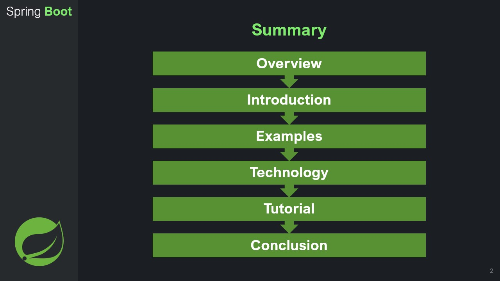

 context / extra information

# 

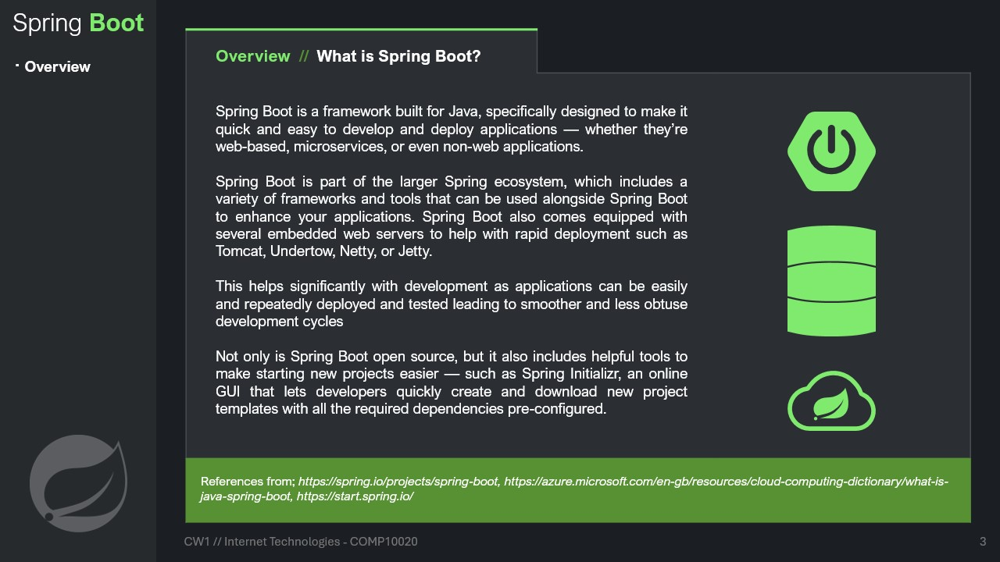

context / extra information

## 

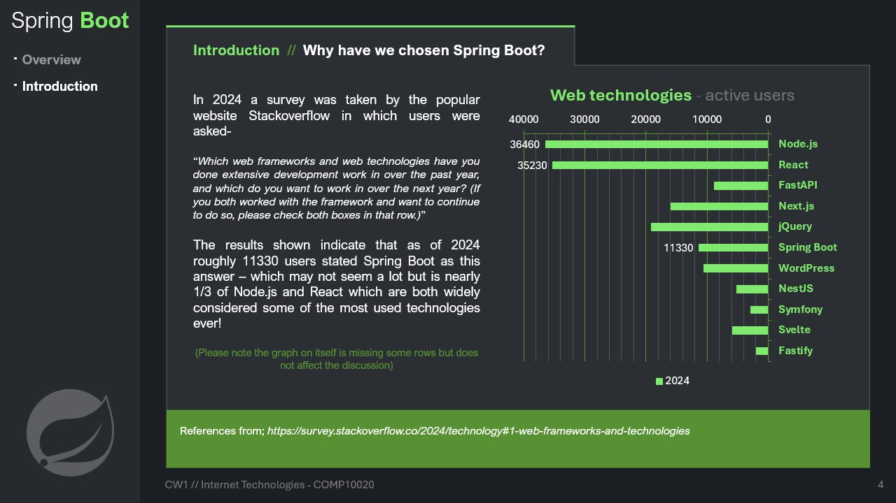

 context / extra information

## 

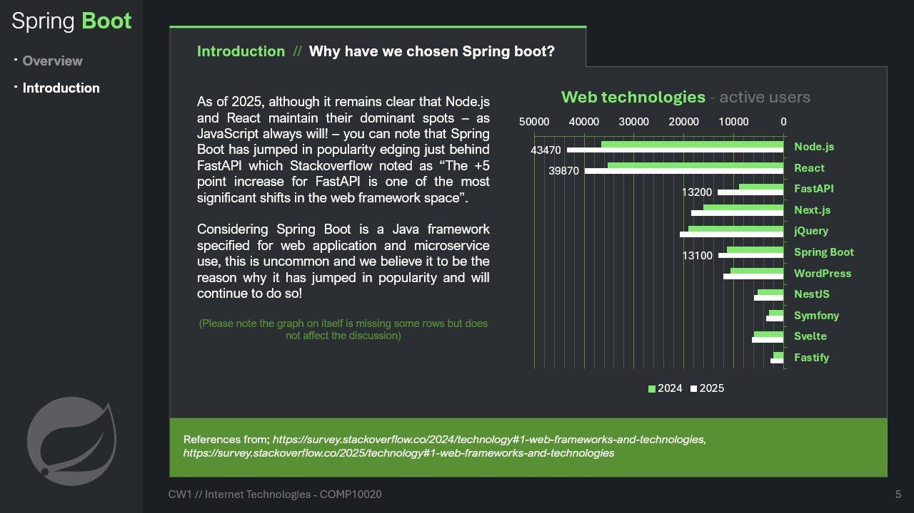

 context / extra information

## 

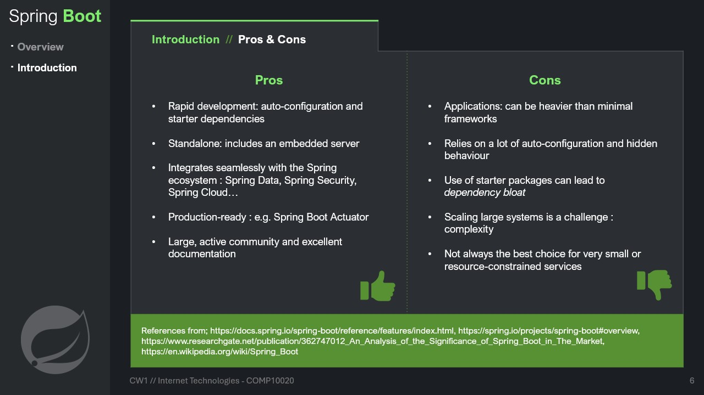

context / extra information

## 

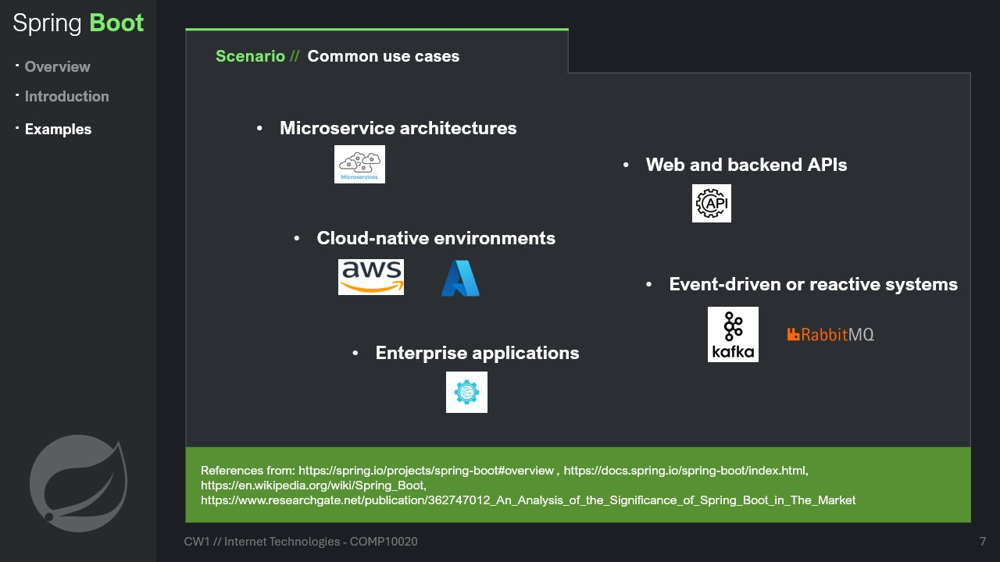

context / extra information

## 

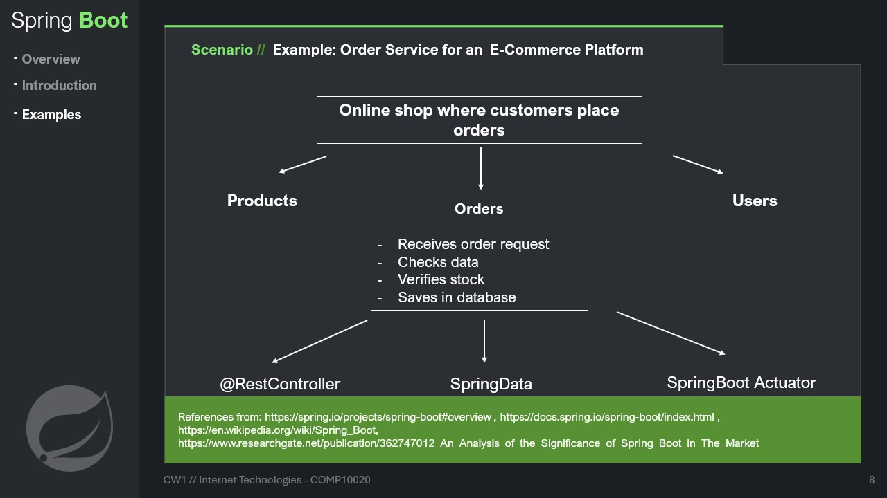

context / extra information

## 

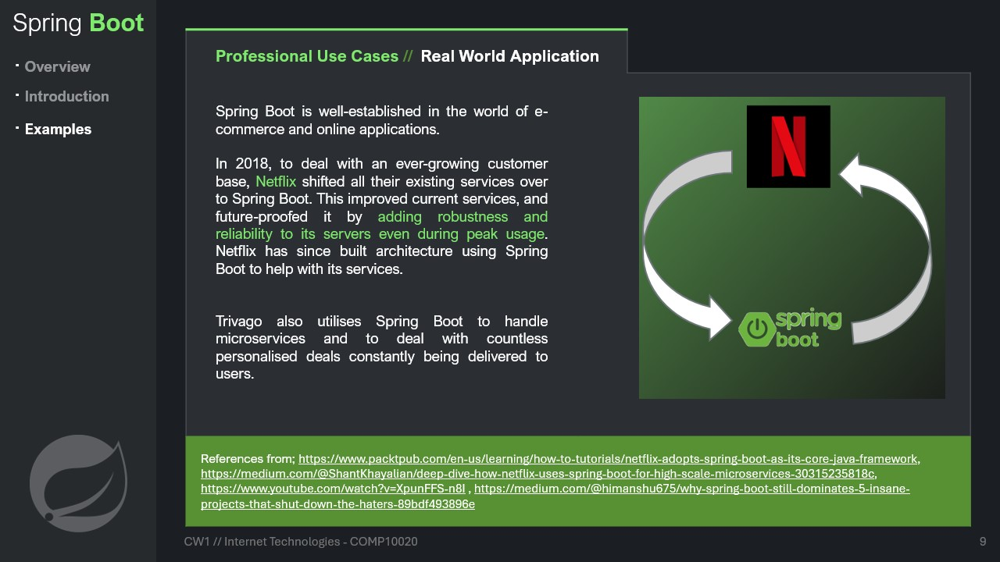

 Netflix has over **200 million users** on their platform so their applications must be run through a framework that can handle that much traffic. Netflix has over **3000 applications all running through Spring Boot**.

Trivago has also distributed **hundreds of millions of specific, personalised offers** to users.
## 

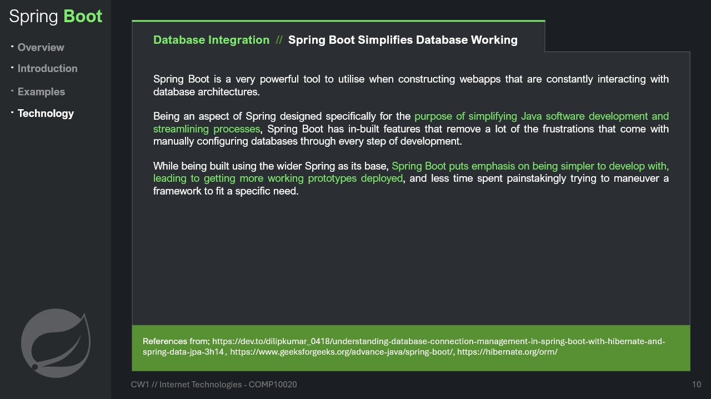

context / extra information

## 

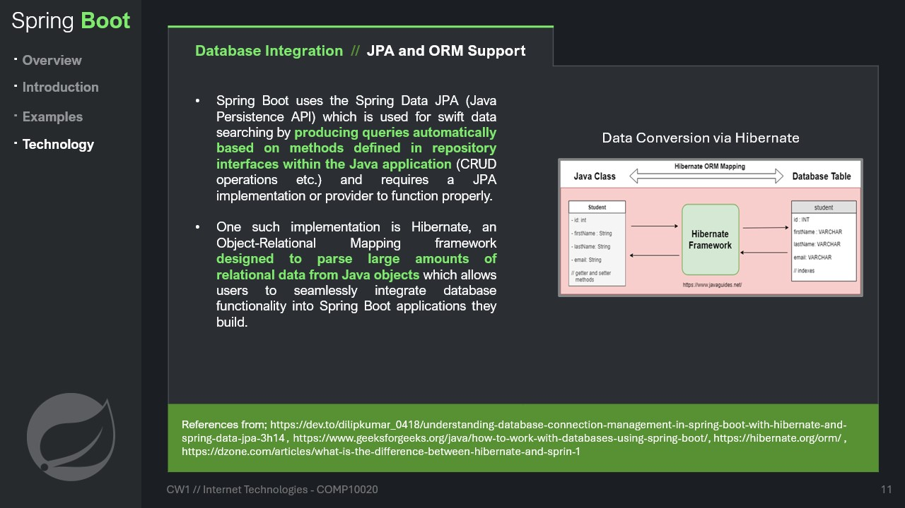

context / extra information

## 

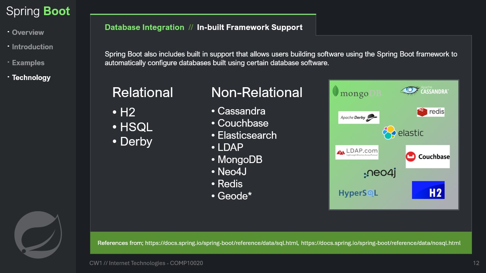

context / extra information

## 

context / extra information

## 

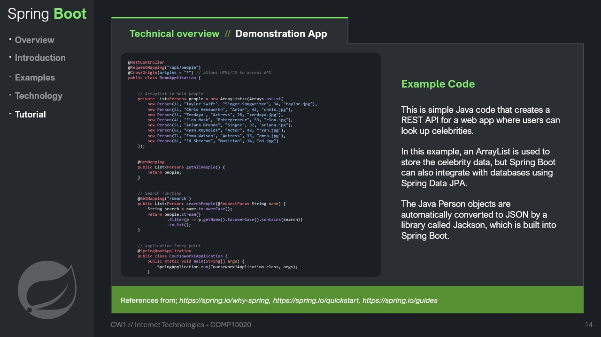

context / extra information

## 

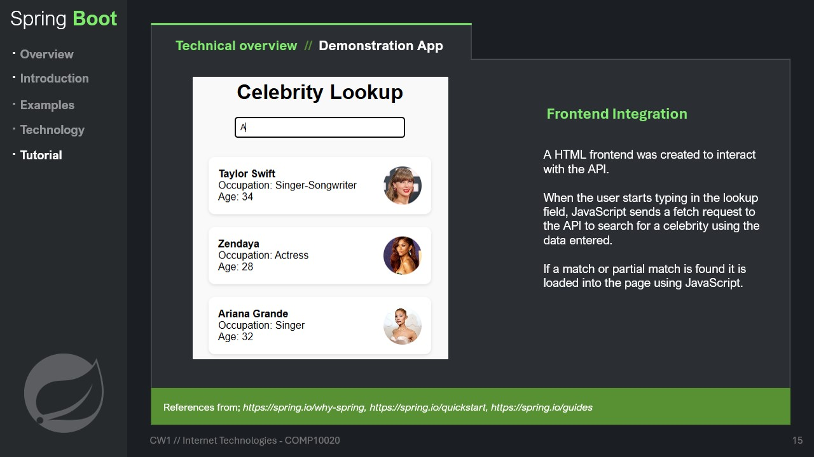

context / extra information

## 

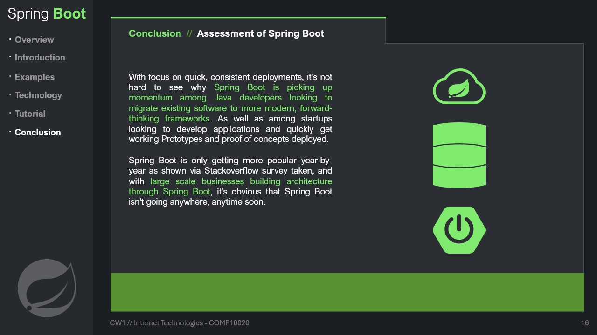

context / extra information

## 