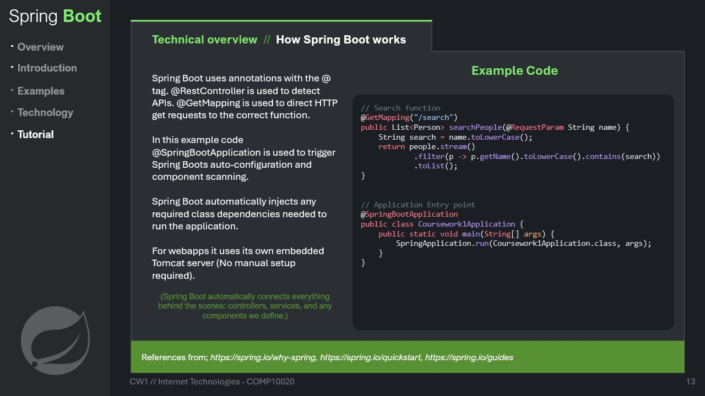



# Spring Boot Presentation

---
### Table of Contents
- [Spring Boot Presentation](#spring-boot-presentation)
  - [Introduction](#introduction)
  - [Examples](#examples)
  - [Technology](#technology)
  - [Tutorial](#tutorial)
  - [Conclusion](#conclusion)

---

 context / extra information

---

 context / extra information

---
## Introduction
---

context / extra information

---

 context / extra information

---

 context / extra information

---

context / extra information

---
## Examples
---

context / extra information

---

context / extra information

---

 Netflix has over **200 million users** on their platform so their applications must be run through a framework that can handle that much traffic. Netflix has over **3000 applications all running through Spring Boot**.

Trivago has also distributed **hundreds of millions of specific, personalised offers** to users.

---
## Technology
---

For both existing businesses and start-ups, **it is vastly easier to justify a project and to successfully get a point across through functioning prototypes that actually exist in front of a user** (even if a prototype is unfinished or bug-riddled), rather than through hypotheticals and ideas.

This is what makes Spring Boot such an attractive option. There's an understanding that more time spent in development without a working prototype means less user feedback, and could hold other departments of a project back.

---

While other implementations such as EscapeLink exist, Hibernate is by far the most popular amongst them, with the most usage and in-depth documentation. 

Hibernate removes human error from database configuration by mitigating manual data entry and **produces intrinsically legitimate relations automatically through Java objects**.

---

Netflix utilises Cassandra through Spring Boot to deal with the immense amout of data they hold. 

While Spring Boot comes equipped with fundamental support for a wealth of database frameworks, **these are not the only frameworks compatible with Spring Boot projects.** If developers are attached to other particular database frameworks (such as MySQL or PostgreSQL), these frameworks can still be manually configured as normal to work with Spring Boot.

---

## Tutorial
---

context / extra information

---

context / extra information

---

context / extra information

---

## Conclusion
---

With AI solutions increasing in popularity at a seemingly exponential rate, there **isn't time for development teams to manually navigate through obtuse configuration procedures** and cobble together solutions that theortically might work. Spring Boot is built fundamentally with ease-of-use and smooth deployments in mind.
