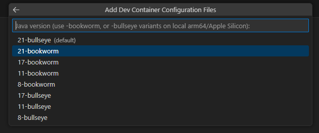
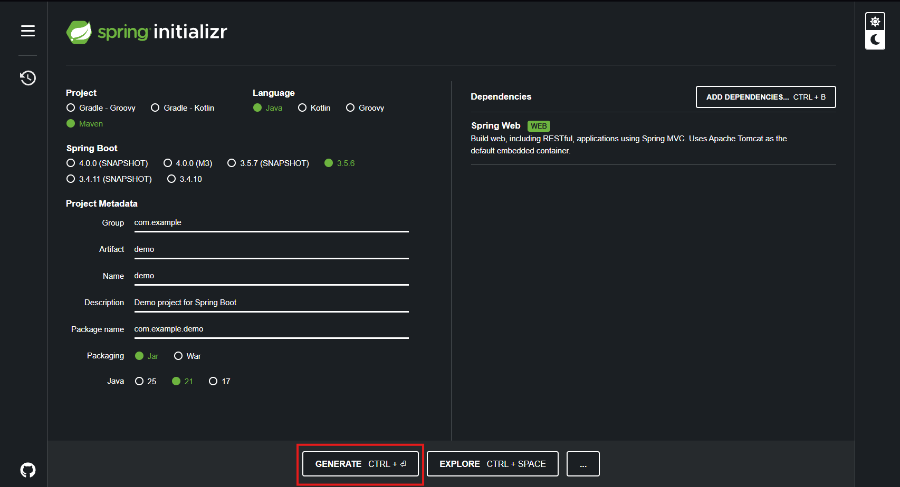



# Spring Boot Tutorial

---

- [Spring Boot Tutorial](#spring-boot-tutorial)
  - [Set up VS Code and Docker](#set-up-vs-code-and-docker)
  - [Set up Spring Boot](#set-up-spring-boot)
  - [Frontend Setup](#frontend-setup)
  - [Running the App](#running-the-app)

Welcome to our Spring Boot tutorial. In this tutorial, we will show you how to set up a simple celebrity lookup API.

## Set up VS Code and Docker


To start with, we will set up a Docker container in VS Code. With an empty window, press **Ctrl + Shift + P** at the same time.


Search for "dev" and select **Dev Containers: Open folder in container**.


Select **Add configuration to workspace**.


Search for **Java** and select it.



Select **21-bookworm**.


With Spring Boot, you can use both Maven and Gradle, but for this demo, we will use Maven.

## Set up Spring Boot

Now that Docker is set up, let’s set up Spring Boot. Go to [Spring Initializr](https://start.spring.io).


To ensure Spring Boot loads properly, use the following settings:

- **Project:** Maven  
- **Language:** Java  
- **Spring Boot:** 3.5.6  
- **Java:** 21 *(Important)*


Once you have selected the correct options, go ahead and add dependencies.


Search for **Web**, select **Spring Web**, and add it to your dependencies.



Select **Generate**, and it will create a `.zip` folder.


Navigate to where you saved the `.zip` file and extract it.


You’ll want to extract it to the folder you opened the container in *(outside the .devcontainer folder)*.


If you open VS Code back up, you will notice a new folder — go ahead and open it.


Navigate to `src > main > java > com > example > demo` and open the `DemoApplication.java` file.


Underneath the current imports, add imports for the following:

```java
import org.springframework.web.bind.annotation.CrossOrigin;
import org.springframework.web.bind.annotation.GetMapping;
import org.springframework.web.bind.annotation.RequestMapping;
import org.springframework.web.bind.annotation.RequestParam;
import org.springframework.web.bind.annotation.RestController;
import java.util.*;
```


Next, create a `Person` class. In the same folder as `DemoApplication.java`, create a new file and call it `Person.java`.


Inside this file, declare the elements (variables) that make up a person:

```java
public class Person {
    private Long id;
    private String name;
    private String occupation;
    private int age;
    private String image;

    public Person(Long id, String name, String occupation, int age, String image) {
        this.id = id;
        this.name = name;
        this.occupation = occupation;
        this.age = age;
        this.image = image;
    }

    public Long getId() { return id; }
    public String getName() { return name; }
    public String getOccupation() { return occupation; }
    public int getAge() { return age; }
    public String getImage() { return image; }

    public void setId(Long id) { this.id = id; }
    public void setName(String name) { this.name = name; }
    public void setOccupation(String occupation) { this.occupation = occupation; }
    public void setAge(int age) { this.age = age; }
    public void setImage(String image) { this.image = image; }
}
```


Once this is done, go back to `DemoApplication.java` and remove the `@SpringBootClass` annotation — we will use this elsewhere later.


Replace it with the following:

```java
@RestController
@RequestMapping("/api/people")
@CrossOrigin(origins = "*") // allows HTML/JS to access API
```


Now add an ArrayList of celebrities for the API to search through:

```java
// Arraylist to hold people
private List<Person> people = new ArrayList<>(Arrays.asList(
    new Person(1L, "Taylor Swift", "Singer-Songwriter", 34, "taylor.jpg"),
    new Person(2L, "Chris Hemsworth", "Actor", 41, "hemsworth.jpg"),
    new Person(3L, "Zendaya", "Actress", 28, "zendaya.jpg"),
    new Person(4L, "Elon Musk", "Entrepreneur", 53, "musk.jpg"),
    new Person(5L, "Ariana Grande", "Singer", 32, "grande.jpg"),
    new Person(6L, "Ryan Reynolds", "Actor", 48, "reynolds.jpg"),
    new Person(7L, "Emma Watson", "Actress", 35, "watson.jpg"),
    new Person(8L, "Ed Sheeran", "Musician", 34, "sheeran.jpg")
));
```


Add a `getAllPeople` function:

```java
public List<Person> getAllPeople() {
    return people;
}
```


Now add the main search function:

```java
// Search function
@GetMapping("/search")
public List<Person> searchPeople(@RequestParam String name) {
    String search = name.toLowerCase();
    return people.stream()
        .filter(p -> p.getName().toLowerCase().contains(search))
        .toList();
}
```


In the code, find the section `public static void main` and replace it with:

```java
// Application Entry point
@SpringBootApplication
public class Coursework1Application {
    public static void main(String[] args) {
        SpringApplication.run(Coursework1Application.class, args);
    }
}
```

Once complete, your full `DemoApplication.java` should look like this:

```java
package com.example.demo;

import org.springframework.boot.SpringApplication;
import org.springframework.boot.autoconfigure.SpringBootApplication;
import org.springframework.web.bind.annotation.CrossOrigin;
import org.springframework.web.bind.annotation.GetMapping;
import org.springframework.web.bind.annotation.RequestMapping;
import org.springframework.web.bind.annotation.RequestParam;
import org.springframework.web.bind.annotation.RestController;
import java.util.*;

@RestController
@RequestMapping("/api/people")
@CrossOrigin(origins = "*") // allows HTML/JS to access API
public class DemoApplication {

    private List<Person> people = new ArrayList<>(Arrays.asList(
        new Person(1L, "Taylor Swift", "Singer-Songwriter", 34, "taylor.jpg"),
        new Person(2L, "Chris Hemsworth", "Actor", 41, "hemsworth.jpg"),
        new Person(3L, "Zendaya", "Actress", 28, "zendaya.jpg"),
        new Person(4L, "Elon Musk", "Entrepreneur", 53, "musk.jpg"),
        new Person(5L, "Ariana Grande", "Singer", 32, "grande.jpg"),
        new Person(6L, "Ryan Reynolds", "Actor", 48, "reynolds.jpg"),
        new Person(7L, "Emma Watson", "Actress", 35, "watson.jpg"),
        new Person(8L, "Ed Sheeran", "Musician", 34, "sheeran.jpg")
    ));

    @GetMapping
    public List<Person> getAllPeople() {
        return people;
    }

    @GetMapping("/search")
    public List<Person> searchPeople(@RequestParam String name) {
        String search = name.toLowerCase();
        return people.stream()
            .filter(p -> p.getName().toLowerCase().contains(search))
            .toList();
    }

    @SpringBootApplication
    public class Coursework1Application {
        public static void main(String[] args) {
            SpringApplication.run(Coursework1Application.class, args);
        }
    }
}
```


## Frontend Setup


Now that we have our Java logic set up, we will create a frontend to use the API. Navigate to `resources > static` and create an `index.html` file.

Inside the file, create a simple HTML structure:

```html
<!DOCTYPE html>
<html lang="en">
<head>
  <meta charset="UTF-8">
  <title>Celebrity Lookup</title>
</head>
<body>
  <h1>Celebrity Lookup</h1>
  <input type="text" id="searchBox" placeholder="Type a name...">
  <div id="results"></div>
</body>
</html>
```

The input field acts as the search box, and the div with id `results` will display search results. Next, add the following styles inside the `<head>` tags:

```html
<style>
  body {
    font-family: Arial, sans-serif;
    margin: 40px;
    background: #f9f9f9;
  }

  h1 {
    text-align: center;
    margin-bottom: 20px;
  }

  input {
    padding: 8px;
    width: 250px;
    margin-bottom: 20px;
    display: block;
    margin-left: auto;
    margin-right: auto;
    border: 1px solid #ccc;
    border-radius: 4px;
  }

  .person {
    background: white;
    border-radius: 10px;
    box-shadow: 0 2px 5px rgba(0, 0, 0, 0.1);
    margin: 10px auto;
    padding: 15px;
    width: 320px;
    display: flex;
    align-items: center;
    justify-content: space-between;
  }

  .person-info {
    flex-grow: 1;
  }

  #results {
    display: flex;
    flex-direction: column;
    align-items: center;
  }
</style>
```

Next, add the following JavaScript inside the `<body>` tags, below the `<div>`:

```html
<script>
  const searchBox = document.getElementById('searchBox');
  const resultsDiv = document.getElementById('results');

  searchBox.addEventListener('input', async () => {
    const query = searchBox.value.trim();
    if (!query) {
      resultsDiv.innerHTML = '';
      return;
    }

    const response = await fetch(`/api/people/search?name=${encodeURIComponent(query)}`);
    const people = await response.json();

    if (people.length === 0) {
      resultsDiv.innerHTML = '<p>No results found</p>';
      return;
    }

    const html = people.map(p => `
      <div class="person">
        <div class="person-info">
          <strong>${p.name}</strong><br>
          Occupation: ${p.occupation}<br>
          Age: ${p.age}
        </div>
      </div>
    `).join('');

    resultsDiv.innerHTML = html;
  });
</script>
```

Once done, your full HTML should look like this:

```html
<!DOCTYPE html>
<html lang="en">
<head>
  <meta charset="UTF-8">
  <title>Celebrity Lookup</title>
  <style>
    body {
      font-family: Arial, sans-serif;
      margin: 40px;
      background: #f9f9f9;
    }

    h1 {
      text-align: center;
      margin-bottom: 20px;
    }

    input {
      padding: 8px;
      width: 250px;
      margin-bottom: 20px;
      display: block;
      margin-left: auto;
      margin-right: auto;
      border: 1px solid #ccc;
      border-radius: 4px;
    }

    .person {
      background: white;
      border-radius: 10px;
      box-shadow: 0 2px 5px rgba(0, 0, 0, 0.1);
      margin: 10px auto;
      padding: 15px;
      width: 320px;
      display: flex;
      align-items: center;
      justify-content: space-between;
    }

    .person-info {
      flex-grow: 1;
    }

    #results {
      display: flex;
      flex-direction: column;
      align-items: center;
    }
  </style>
</head>
<body>
  <h1>Celebrity Lookup</h1>
  <input type="text" id="searchBox" placeholder="Type a name...">
  <div id="results"></div>

  <script>
    const searchBox = document.getElementById('searchBox');
    const resultsDiv = document.getElementById('results');

    searchBox.addEventListener('input', async () => {
      const query = searchBox.value.trim();
      if (!query) {
        resultsDiv.innerHTML = '';
        return;
      }

      const response = await fetch(`/api/people/search?name=${encodeURIComponent(query)}`);
      const people = await response.json();

      if (people.length === 0) {
        resultsDiv.innerHTML = '<p>No results found</p>';
        return;
      }

      const html = people.map(p => `
        <div class="person">
          <div class="person-info">
            <strong>${p.name}</strong><br>
            Occupation: ${p.occupation}<br>
            Age: ${p.age}
          </div>
        </div>
      `).join('');

      resultsDiv.innerHTML = html;
    });
  </script>
</body>
</html>
```

---

## Running the App


In VS Code, open the console (**Ctrl + '**) and enter:

```bash
cd demo
```

Then, run:

```bash
./mvnw spring-boot:run
```

This will start the integrated Tomcat server and launch your app.

You should now be able to visit [localhost:8080](http://localhost:8080) and see your app in action.
